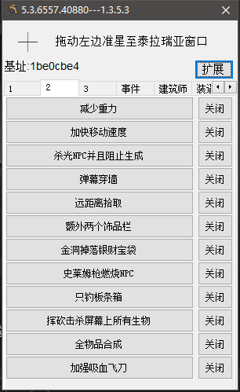
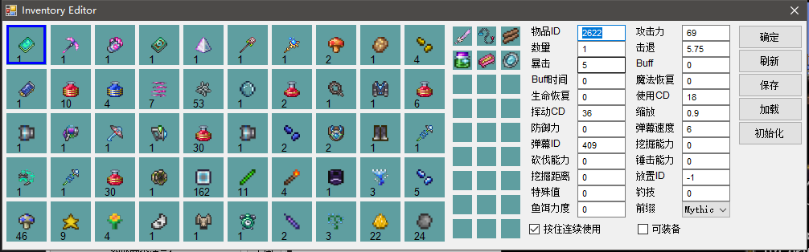
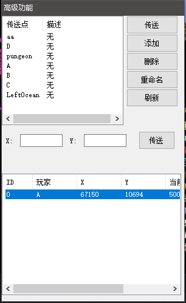
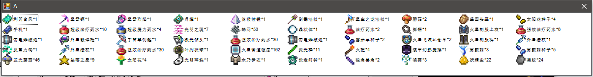
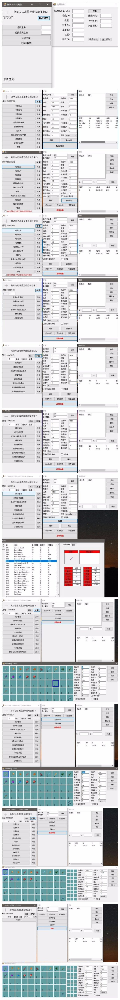

# TR_Hacker
## 简述
TR_Hacker，正式名称为Terraria Hacker，用于对游戏Terraria进行内存修改。
功能上可以说非常Strong了，而且效率比大部分修改器要高。

## 环境要求(你能在Release压缩包中的说明书内找到，部分修改):

修改器使用环境：
>CPU：最好是Intel Core系列的，除了Intel和AMD的CPU，几乎完全不支持  
操作系统：Windows 7及以上，64位  
.Net：4.6.2，不要安装多个版本的.Net!   
Terraria：1.3.5.3  

## 特色:
包括但不限于:
>可视化物品修改  
强大的脚本  
背包的保存与恢复  
传送玩家以及查看玩家背包  
多种骚操作，例如燃烧友好NPC等等  

从类型来说，THK支持30~40项修改，而从数量上来说，支持上百种修改。
有一些功能是需要特地说一说的：

* 可以直接添加物品到背包，这意味着不再需要修改已有物品类型再重新拾取或者重新进入而获得正确的物品。
* 直接初始化物品属性，在界面输入物品类型，数量，前缀然后点击初始化，即可在选定位置获得一个属性完整的物品。
* 保存背包可直接将当前背包信息保存到一个文件(.inv)，包括装备、饰品、燃料等。
* 加载背包可直接把上一步或者从其他途径得到的背包文件(.inv)加载到当前背包。
* 支持插件(代替了说明书中提到的脚本)，修改器在HackFunctions类中提供了很多函数用于修改，使用C#为修改器编写插件可以调用这些函数。值得一提的是，修改器实际上提供了几乎所有的物品属性修改接口，但是界面上空间不足，所以只提供了重要的属性修改，编写插件可以调用这些接口，实现修改器原本没有的功能。
* 插件的说明书可在Release压缩包中找到，同时还有一份插件的样例，样例提供了几个简单的功能。

## 部分截图:
主界面第二页选项卡中的功能:  
  
背包编辑器:  
  
高级功能(传送到玩家之类的):  
  
查看背包(可对其他玩家):  
  

## 工程结构:
构建时产生的二进制文件会被输出到./Debug和./Release文件夹
>TR_Hacker_DLL:修改器的修改逻辑实现  
Language:	C  
IDE:		Code::Blocks  
Terraria_Hacker:修改器的界面逻辑  
Language:	C#  
IDE:		SharpDevelop/VS  
TR_DATA:没有用的东西，曾用来查看一些简单的数据  
Language:	C#  
IDE:		SharpDevelop/VS  
RegisterInfo:已经弃用，曾用于生成注册信息  
Language:	C#  
IDE:		SharpDevelop/VS  
Register:已经弃用，曾用于根据注册信息生成注册码  
Language:	C  
IDE:		Code::Blocks  
Hacker_Test:已经弃用，曾用于检查修改器无法使用的原因  
Language:	C  
IDE:		Code::Blocks  
Image_Packer:用于打包图片文件  
Language:	C#  
IDE:		SharpDevelop/VS  
MyCheatLibrary:改造过的CheatLibrary，负责一些比较高级的工作  
Language:	C++  
IDE:		VS  
TR_DDOS:用于攻击Terraria服务器，大部分代码来自Terraria  
Language:	C#  
IDE:		SharpDevelop/VS  

## 关于开源:
开源服从协议 GPL V3。

## 作者的话:
说实话，这个项目的开始时间是2015年7月，距今已快三年，那时候作者仍是一个身处七年级，刚准备上八年级的少年。  
项目开始时，Terraria才刚进入1.3时代，内存修改还没有发展起来，那时候最多是神端、CT。  
神端不好说，CT所能做的事情十分有限，那时候总的修改水平很低。  
2015年7月，有天在群里遇到了研究内存修改的子程，向他求教了几十天，便有了这个修改器的雏形。  
修改器最早是控制台版本的，通过输入指令和数据来完成操作，使用效率低，后来才制作了界面版，2016年3月放弃了更新。  
2016年暑假遇到了一伙人，聊得很投机，聊到了修改器，突然兴致大涨，找回源码重构，于是就有了现在这个版本的前身(下面图第二张)。  
那年由于永恒之地服务器被熊事件，我们成立了自己的组织:THK，漫漫更新路开始。  
每次Terraria更新后，THK也会跟着更新，功能也越来越完善。  
2017年，作者已经九年级了，较以前技术有了很大的进步，大部分的特殊功能就是这段时间完成的(中考前还在更新修改器)。  
2017年12月，修改器对应游戏1.3.5.3版本最后一次更新(Final release for 1.3.5.3)。  
现在是2018年4月13日，Terraria仍然是1.3.5.3，但是只要游戏还更新，THK就不会停更。  
PS:  
* 修改器使用到的语言只有三种：C#、C、C++，没有使用易语言。  
* 没有使用CEAA，这个其实很容易看出，因为使用CEAA的修改器效率都非常低。  
* 没有抄袭任何其他修改器，但其实又能有多少修改器比这个更早呢？或是值得抄呢？这一点可以从源码中得到验证。  
* 修改器由作者独立完成开发，没有其他任何个人或者组织提供帮助，也不存在所谓合作。 
* 修改器用到的MyCheatLibrary库是作者自己编写的，其来源CheatLibrary(很早就开源了)也是作者自己编写的，部分代码参考CE源码。  
这里特地指出这些，是因为有些人总是怀着最大的恶意来揣测他人。
对于这些人，我想告诉你们：不要总以为你自己不行，别人就不行，世界大得很。
  
修改器的发展进程(最早的那张对应的版本是2015年九月完成的)：  

